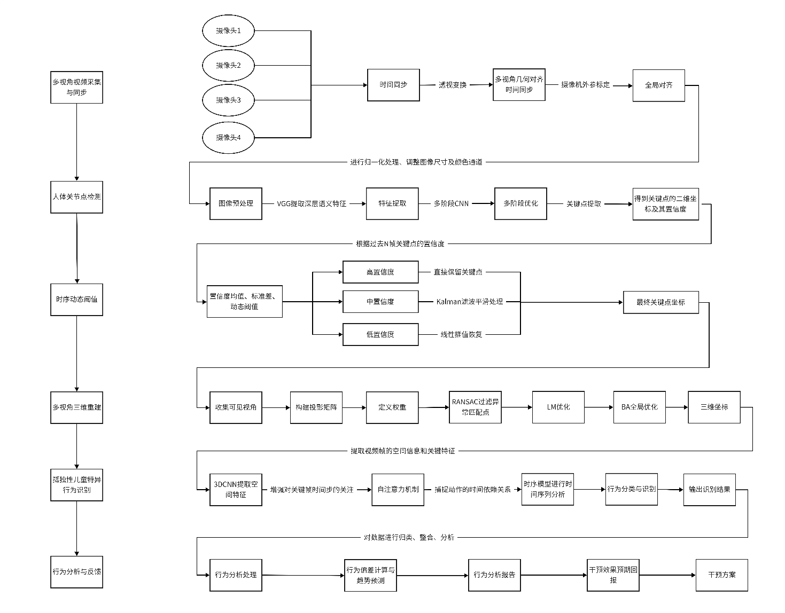

依托发明专利整套算法，AutoBehav3D基于多目视觉+时序关键点优化+加权三维重建+3DCNN-LSTM时序建模，实现孤独症儿童课堂无接触全自动行为分析，落地特殊教育课堂测评与康复干预场景。

<!--more-->

<video width="320" height="240" autoplay loop muted >
      <source src="./demo.mp4"  type="video/mp4">
</video>

## 项目概述
传统孤独症课堂行为评测依赖人工观察记录，效率低下、主观误差突出；单目视觉方案受视角遮挡影响，极易造成肢体动作信息缺失，识别精度不足。

本项目完整落地专利技术链路：四目同步视频采集→时序动态阈值优化关键点→加权RANSAC+LM光束平差三维重建→3DCNN+LSTM时序行为分类，自动对照DSM-5诊断标准识别孤独症典型异常行为，输出量化统计数据、行为趋势报告与个性化教育干预建议。

## 核心原理
1. **多视角时空对齐采集**：教室四角布设摄像头，棋盘格标定完成时空配准，统一全部画面至全局三维坐标系；
2. **时序自适应关键点优化**：OpenPose输出人体2D关键点，依托N帧置信度构建动态阈值，采用Kalman滤波/线性插值分级修复关键点抖动与缺失；
3. **多视图加权三维重建**：融合关键点置信度、基线长度、深度信息构建投影权重，RANSAC剔除异常匹配点，LM+光束平差全局优化三维人体坐标；
4. **DSM标准驱动行为识别**：3DCNN提取动作空间特征，LSTM挖掘时序运动规律，精准区分社交缺陷、刻板动作、肢体协调异常八大类孤独症行为；
5. **时序预测与干预生成**：LSTM预测后续行为变化趋势，自动生成量化报表与针对性康复指导方案。

## 实验效果
在幼儿园、特教课堂实测数据集验证：关键点稳定性较原生OpenPose提升37%，三维重建重投影误差显著降低，八大类孤独症典型行为综合识别准确率92%+，支持异常行为实时预警推送至教师管理端。

## 应用场景
特教学校课堂常态化行为监测、自闭症康复机构行为量化测评、儿童发育科研数据采集、个性化康复干预方案辅助制定。

本技术依托发明专利（一种孤独症儿童课堂行为分析方法及分析系统）