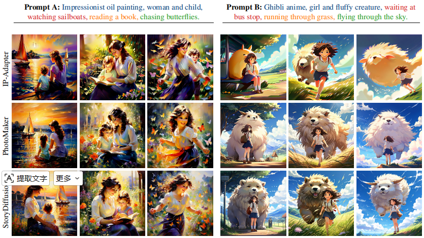
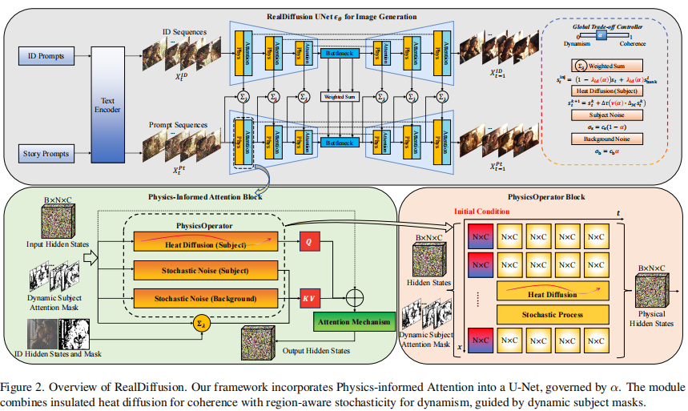
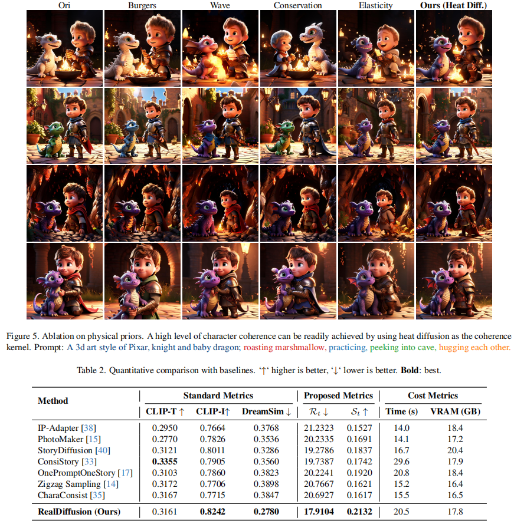

依托CVPR收录工作RealDiffusion，基于热传导物理先验注意力机制实现多角色连贯故事动画生成，落地自闭症儿童康复动画制作场景。

<!--more-->

<video width="320" height="240" autoplay loop muted >
      <source src="./expo_live.mp4"  type="video/mp4">
</video>

## 项目概述
现有扩散模型生成多帧故事动画普遍存在两大痛点：人物身份错乱、角色特征漂移、画面动作不连贯，难以适配特殊儿童认知康复素材生产需求。

本文提出RealDiffusion免训练框架，在预训练扩散模型中嵌入物理感知注意力模块，依靠热传导方程约束时序特征，兼顾角色一致性与故事动态变化，无需微调模型权重，轻量化嵌入现有生成管线。

## 核心原理
1. **动态掩码自动生成**：利用交叉注意力逐帧生成人物区域掩码，精准约束角色特征。
2. **双内核物理算子**：通过热扩散平滑帧间变化，保证角色身份稳定；同时保留动作动态性。
3. **物理感知注意力机制**：从模型底层保障角色身份统一、时序画面连贯。
4. **全局平衡参数**：自由权衡“角色一致性”与“动作自由度”。

## 图片说明
- group.jpg：多风格故事样例效果图（吉卜力、中式国风、美式漫画）
- framework.png：网络框架结构图
- mask.png：人物动态掩码示意图
- comparison.png：与主流方法效果对比图
- ablation.png：物理先验与参数消融实验图

## 实验效果
在300组多角色测试集上，RealDiffusion在角色相似度、故事连贯性、时序规整度指标均超越现有方案，推理速度快、显存占用低。

## 应用场景
可用于自闭症儿童康复训练、特殊教育、社交故事生成、视觉认知干预等场景。

本技术已申请发明专利（公开号：CN120563736A）